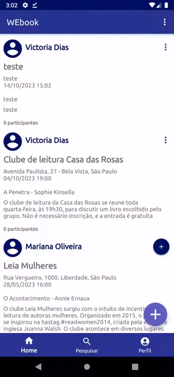

<h4>WEBOOK</h4>
Meu primeiro app mobile desenvolvido durante o projeto de Atividade Extensionista da minha graduação em Engenharia de Software

##Sumário

* [Objetivo](#objetivo)
* [Interfaces](#interfaces)
    * [Tela de login](#tela-de-login)
    * [Tela de cadastro](#tela-de-cadastro)
    * [Tela de criação de eventos](#tela-de-criação-de-eventos)
    * [Excluir e confirmar presença em evento](#excluir-e-confirmar-presença-em-evento)
* [Licença](#licença)
* [Reportar bugs ou sugerir funcionalidades](#reportar-bugs-ou-sugerir-funcionalidades)

## 1. Objetivo
O aplicativo foi desenvolvido com o propósito de servir como um local para os usuários cadastrarem eventos de clubes de leitura e receberem confirmações das pessoas que tem interesse em participar deles

##2. Interfaces
Seguem demonstrações de algumas das principais funcionalidades oferecidas pelo app:

###2.1 Tela de login

###2.2 Tela de cadastro

###2.3 Tela de criação de eventos

###2.4 Excluir e confirmar presença em evento

###3. Licença
Distribuído sob a licença MIT.

### 4. Reportar bugs ou sugerir funcionalidades
Caso queira reportar algum bug ou sugerir uma nova funcionalidade ao app, acesse [aqui](https://github.com/MayaVictDias/webook/issues) 
